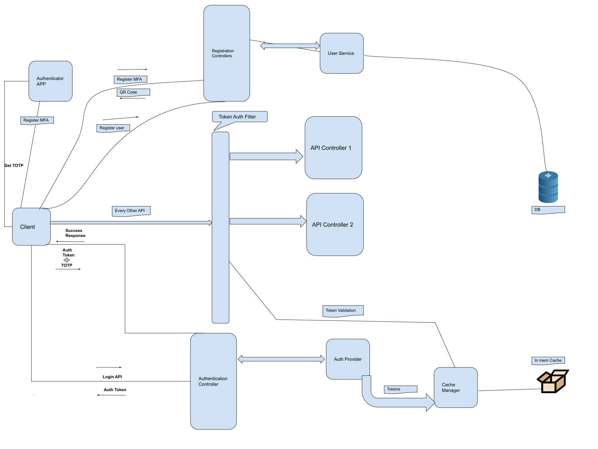

# SpringBoot App with Multifactor Authentication

This is a Simple Spring boot app which incorporates 2 factor authentication.

This app uses TOTP Algorithm to perform the 2nd Factor Authentication. Any TOTP Mobile App can be used to perform the authentication like Google Authenticator, Microsoft Authenticator,etc.

<h3> Below is the simple design of the components used: </h3>

  

